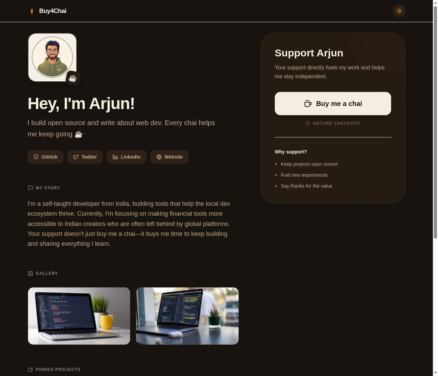
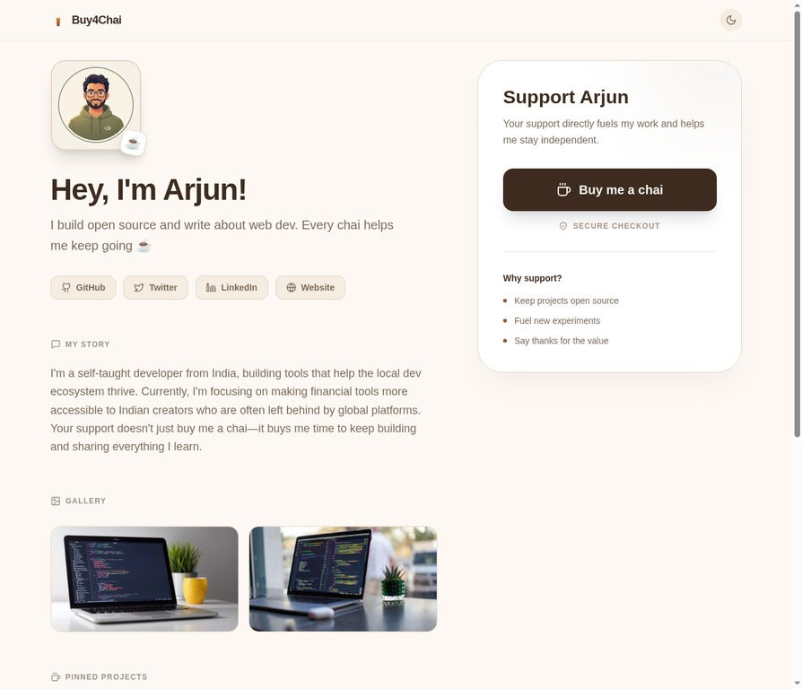

<div align="center">
  
  <h1>Buy Me a Chai ☕</h1>
  <p><strong>The narrative-driven, self-hosted supporter page for the modern Indian developer.</strong></p>

  <p>
    
    
    
  </p>

  <p>
    <a href="https://buy4-chai.vercel.app/"><strong>View Demo</strong></a> •
    <a href="#-deployment-in-10-minutes"><strong>Deploy Yours</strong></a> •
    <a href="#-tutorial"><strong>Watch Tutorial</strong></a> •
    <a href="master.md"><strong>The Manifesto</strong></a>
  </p>
</div>

---

## 🛑 The Infrastructure Gap

Platforms like **Buy Me a Coffee** and **GitHub Sponsors** rely on Stripe. In India, Stripe is invite-only, leaving thousands of developers stranded.

Sharing a UPI ID in a README feels "janky." Using PayPal involves massive fees. **Buy Me a Chai** fixes this by building a world-class **UX Layer** on top of the gateways that actually work in India (Razorpay & Dodo Payments).

## ✨ Why this is better

- **📖 Narrative-First Design:** Move beyond transactional forms. Build a connection with your supporters through an editorial-style layout that showcases your mission, your story, and your gallery.
- **💱 Dual-Currency Engine:** A first-of-its-kind system for Indian developers. Set prices in USD, receive in INR. Supporters can toggle currencies in real-time with automatic conversion.
- **💸 0% Platform Fees:** We aren't a middleman. Money moves directly from your supporters to your Razorpay or Dodo account. You keep every rupee.
- **🛡️ Self-Hosted Sovereignty:** You own the deployment. No platform accounts, no vendor lock-in. Host it on your own domain using Vercel, GitHub Pages, or Netlify for free.
- **🔐 Protected Onboarding:** A professional 6-step setup wizard (`/#setup`) that handles everything from identity to gateway keys, gated by a security key for production safety.

---

## 📸 Visuals

### Dark Mode (Default)
[](https://buy4-chai.vercel.app/)

### Light Mode
[](https://buy4-chai.vercel.app/)

---

## 🎨 The Experience

| **Storytelling** | **Project Showcase** | **Dual Currency** |
| :--- | :--- | :--- |
| Build a narrative around your work. Let people know *why* they should support you. | Pin your best open-source projects with high-quality preview cards. | Automatic USD/INR conversion with a simple supporter-facing toggle. |

---

## 📹 Tutorial

Watch the walkthrough video to see the setup wizard and supporter payment flow in action:

<video src="complete.mp4" width="100%" controls="controls">
  Your browser does not support the video tag. You can watch the tutorial video <a href="complete.mp4">here</a>.
</video>

---

## 🚀 Deployment in 10 Minutes

### 1. Fork & Clone
Fork this repository to your own GitHub account and clone it locally.

### 2. Run the Secure Wizard
We built a professional setup wizard right into the app.
1. Run `npm install && npm run dev`
2. Open `http://localhost:3000/#setup?key=chai123` (or the key defined in your `chai.config.js`)
3. Follow the 6-step flow to set your identity, story, projects, and gateway.
4. Copy the generated code into `chai.config.js`.

### 3. One-Click Deploy
Push your changes and connect your repo to **Vercel** or **Netlify**. It will auto-detect Vite and deploy your static site for free.

---

## 🛡️ Secure by Design

- **Public Keys Only:** Buy4Chai never asks for Secret Keys. Your config is safe to be public.
- **Setup Lockdown:** Disable the configuration wizard in production with a single toggle.
- **Password Protection:** Your setup route is gated by a unique key known only to you.

---

## 🔌 Add to your README

Choose a badge style that fits your project's aesthetic:

| Style | Preview | Markdown Snippet (Click to expand) |
| :--- | :--- | :--- |
| **Mono-Chai** |  | <details><summary>Get Code</summary><br><br>```markdown<br>[](https://your-deployment-url.vercel.app)<br>```<br></details> |
| **Bento-Box** |  | <details><summary>Get Code</summary><br><br>```markdown<br>[](https://your-deployment-url.vercel.app)<br>```<br></details> |
| **Light Pill** |  | <details><summary>Get Code</summary><br><br>```markdown<br>[](https://your-deployment-url.vercel.app)<br>```<br></details> |
| **Classic** |  | <details><summary>Get Code</summary><br><br>```markdown<br>[](https://your-deployment-url.vercel.app)<br>```<br></details> |
| **Shields.io** |  | <details><summary>Get Code</summary><br><br>```markdown<br>[](https://your-deployment-url.vercel.app)<br>```<br></details> |

*(Replace `your-deployment-url.vercel.app` with your actual live URL).*

> [!TIP]
> For the **Bento-Box** style, you will have to change the badge name and host it on your own domain. Instead of using the Raw GitHub link, use your own deployment link (e.g., `https://your-name.vercel.app/badges/personal.svg`) for the image source to ensure full control over your branding.


---

## 🤖 AI-Powered Gateway Integration

Want to add a gateway that isn't supported yet? You can use an AI agent (like Antigravity, Claude, or Cursor) to do it for you in seconds.

**The Prompt for your AI Agent:**
> "Read `gateway.md` and the attached documentation for [Gateway Name]. Follow the architectural best practices and the 'Gateway Contract' defined in `gateway.md`. Decide whether to follow the Tier 1 (Redirect) or Tier 2 (SDK) flow based on the provided docs. Implement `src/gateways/[name].js` ensuring 100% static compliance and zero-backend logic."

**User Tip:** Just clone this repo, open your AI agent, attach your payment gateway's documentation, and let the agent run. Provide it with your Public Key ID when asked, and you're ready to host. Simple as that.

---

## 🤖 AI-Powered Setup — Let AI Build Your Page For You

Don't want to fill the config manually? Hand this prompt to any 
AI agent — Claude, Copilot, Cursor, Jules, whatever you use.

**Step 1:** Fork the repo and open it in your AI agent.

**Step 2:** Copy your profile content from wherever you exist 
online — GitHub, LinkedIn, Twitter, your personal site, anywhere. 
Just paste the text content directly into the chat with the prompt 
below. No links needed, the AI doesn't need to browse the web.

**Step 3:** Paste this prompt followed by your copied content:

---

I want to set up my Buy4Chai supporter page. 
I've pasted my profile content below from my online profiles.

Please do the following:

1. Read through everything I've pasted and extract the following:
   - My name
   - A short bio (one or two lines, friendly and human)
   - My avatar/profile image if mentioned or linked
   - My social links (GitHub, LinkedIn, Twitter, website — 
     whatever is present)
   - My best projects worth pinning — name, description, link, 
     and preview image if available

2. Before writing anything, show me what you found and confirm 
   with me:
   - Which projects should be pinned and in what order?
   - Is the bio accurate or should it be reworded?
   - Ask me if I have a profile photo or avatar I want to use — 
     I can paste a URL or upload an image directly
   - Ask me if I have any gallery images I want to show 
     (workspace photos, project screenshots, anything visual)
   - Ask me what thank you message I want supporters to see 
     after they pay

3. Once I've confirmed everything, write it all to 
   chai.config.js only. Do not touch any other file.
   The structure of chai.config.js is already in the repo — 
   follow it exactly, just fill in my real values.

4. Rename the personal badge in public/badges/personal.svg — 
   replace the placeholder name with my actual name.

5. Once done, verify the full flow:
   - Does the page load correctly?
   - Does the payment modal open?
   - Does the thank you screen appear on success?

6. Give me a clean summary of everything that was added and 
   what my next step is to deploy.

Important rules you must follow:
- Only edit chai.config.js and the personal badge — nothing else
- Never ask for or use a secret or private key
- If any information is missing from what I pasted, ask me 
  directly rather than guessing or making something up
- Always confirm with me before writing anything to any file
- Do not assume I use any specific platform — work with 
  whatever content I provide

---

[PASTE YOUR PROFILE CONTENT HERE — from any platform, 
any format, just copy and paste the text]

---

**Step 4:** Answer the agent's questions, confirm your config, deploy.

That's it. Your page is ready.

---

## 🏗️ Architecture

Built with **React 18, Vite, Tailwind CSS, and Framer Motion**.

- **[Master Manifesto](master.md)** — The "Why" and the roadmap.
- **[Design System](design.md)** — The tokens and component architecture.
- **[Gateway Contract](gateway.md)** — How to add a new payment gateway in 10 minutes.

---

<div align="center">
  <p>Built for the Open Source Community 🇮🇳</p>
  <p><i>If this helps you, consider giving it a ⭐</i></p>
</div>
